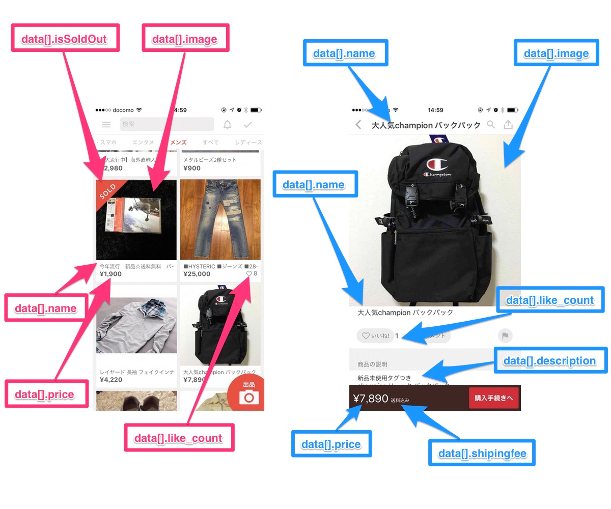

# Merpay/Mercoin frontend skill test

Please do not disclose any information about the skill test to any third party.

## Graphical elements

No graphical elements are provided. Please feel free to use any Free or Open Source resources to create the best user experience.  
Reproduce the provided design specification. For example, if a "Like" icon is a heart, it should stay a heart.

## Evaluation points

* We place importance on confirming the ability to implement using React and Vue.js, so please implement without relying on advanced frameworks such as Next.js and Nuxt.
* About CSS, please use vanilla CSS, please not to use libraries.
* No limit to icons implementation.

* Is the application implemented using TypeScript and passing tests and Lint?
  * Make sure your code is expecting production and could be maintained.
  * Please prepare the production build command assuming a production deploy.
* Does the application meet the minimum requirements as below?

## Minimum requirements

1. The default view for the application is the Item List page.
2. When an item on the Item List page is clicked, the application should navigate to the Item Detail page.
3. Navigating directly to an Item Detail page by URL should be possible.
4. Implement the Item List and Item Detail pages according to the design specification, and reproduce the UI as much as possible.
5. Implement the search form on the Item List page and filter the items by the string entered.
6. Implement the category tabs on the Item List page and filter the items by the category clicked.
   1. please add "all (すべて)" menu to category menu to display non-filtered items.

7. Use the provided [API](./API.md) for showing the items.
8. Use English for communication, commit messages, and comment.
9. Describe the architecture and strategy you have adopted on `README.md`.

## Design specification

