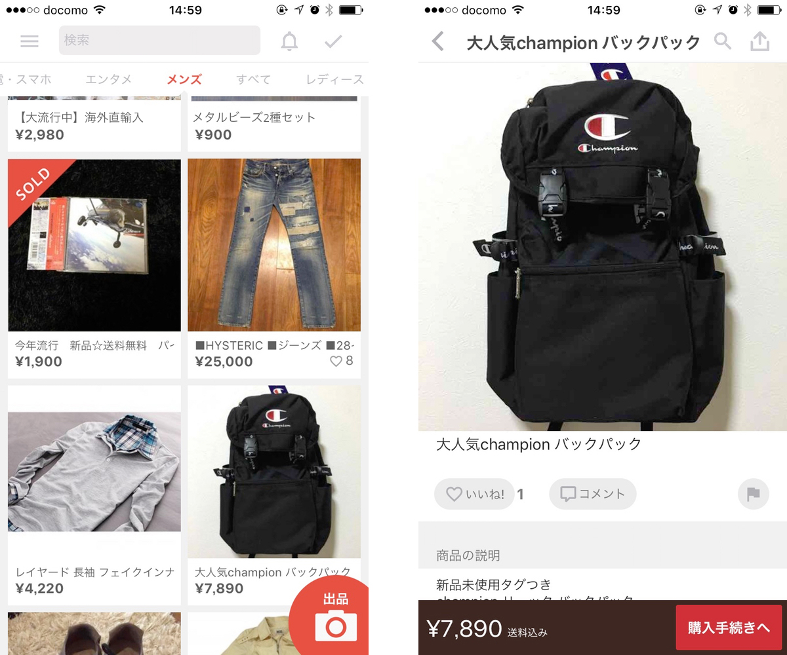
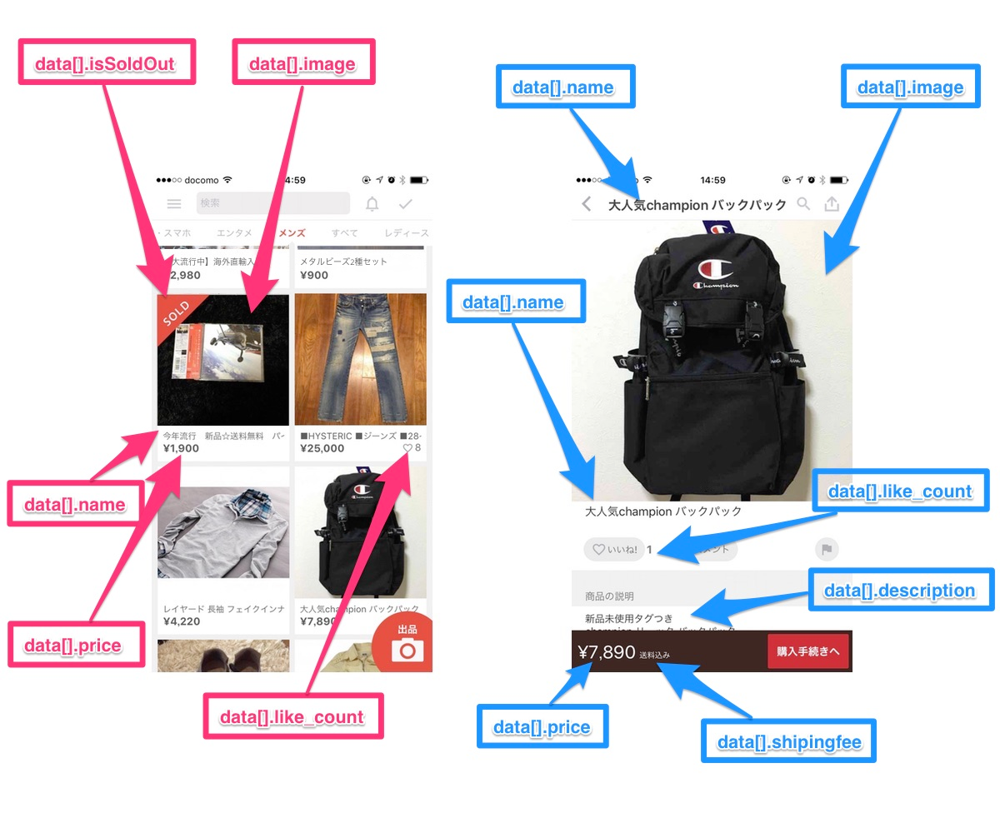

# Merpay/Mercoin frontend skill test

技術試験に関する情報を第三者に開示することはご遠慮ください。

## Graphical elements

グラフィカルな要素は提供していません。ベストな顧客体験を実現するために、フリーまたはオープンソースの素材を自由に使ってください。 
以下に記載されている`デザイン仕様`を再現してください。例えば、「いいね！」のアイコンがハートであれば、ハートのままであるべきです。

## 評価ポイント

* この課題においては React, Vue.js を用いた実装力の確認に重きを置いているため、Next.js, Nuxt などの高機能フレームワークに頼らずに実装してください。
* CSSについても、フレームワークやライブラリを使用せずバニラCSSで記述してください。
* アイコン用のライブラリについては特に制限はありません。
* アプリケーションはTypeScriptを使って実装し、テストや Lint をパスさせてください。
  * 提出したコードが本番運用を想定し、本番用のビルドコマンドを用意しておいてください。
  * 提出したコードが継続してメンテナンスしていくことが可能なのか確認してください。
* アプリケーションは以下の`最低限の要求仕様`を満たしてください。

## 最低限の要求仕様

1. アプリケーションのデフォルト画面はアイテム一覧ページです。
2. アイテム一覧ページのアイテムを押下した時、アプリケーションはアイテム詳細ページに遷移します。
3. アイテム詳細ページにURLで直接アクセスすることが可能です。
4. アイテム一覧とアイテム詳細のページはデザイン仕様に沿って、可能な限りUIを再現してください。
5. アイテム一覧ページに検索フォームを実装し、入力したキーワードでアイテムをフィルターしてください。
6. アイテム一覧ページにカテゴリタブを実装し、選択したカテゴリでアイテムをフィルターしてください。
   1. カテゴリタブにフィルターしていないアイテム一覧を表示するための"すべて"タブを追加してください。
7. アイテムを表示するために[API](./API.md)を使ってください。
8. 質問、コミットメッセージ、コメント等は英語を使ってください。
9. 設計ややったことを`README.md`で説明してください。

## デザイン仕様

