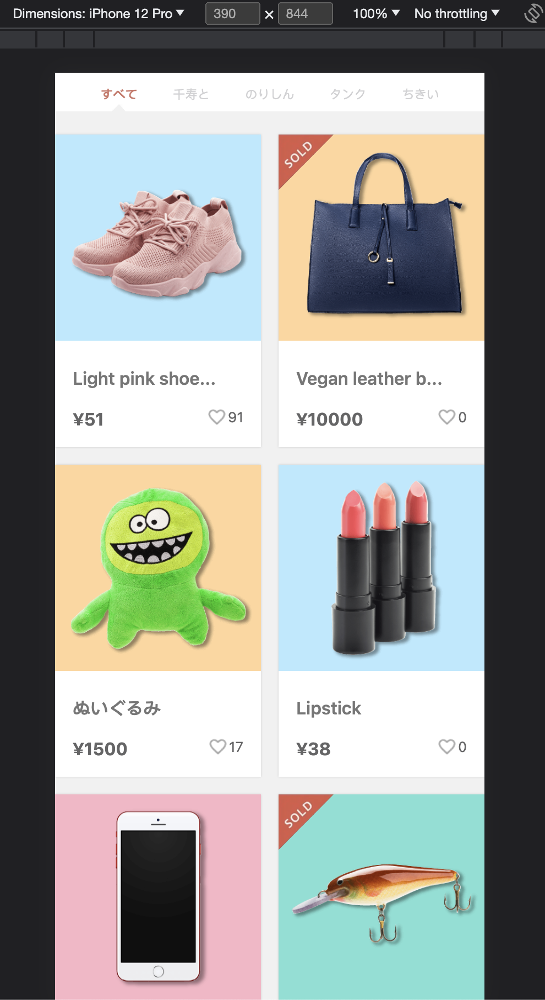
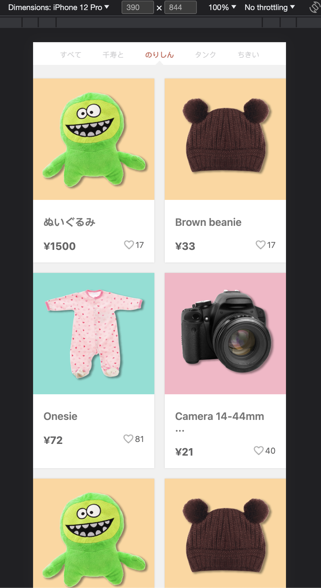
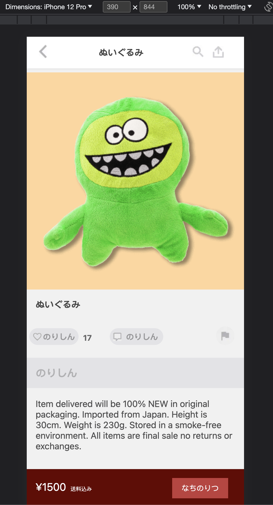

**Disclaimer**

After going through the designs, I realised that some of the Japanese text is not provided. For that reason, I changed my macbook keyboard settings to Japanese and typed some random words(which might not make sense). I did that just to give a feeling of Japanese layout. So if any Japanese words do not make sense then this is the reason.

Secondly, since the design is only for mobile devices therefore, I assumed that it is only for small screens and I only tested it on small screens. It might not completely look good on larger screen.

In addition, I used `vanilla CSS` as it was mentioned in the requirements that vanilla CSS should be used therefore, I avoided using `CSS-in-JS` such as `styled-components` and `emotions` or `CSS preprocessors` such as `SASS` & `Less`.

I also make commits to `master` branch as there was no requirement mentioned for this task.

Finally, this readme file might be different then readmes in the past(I am just trying something slightly different).

# Folder structure

Below is the entire folder structure.

```
├── README.md
├── index.html
├── package-lock.json
├── package.json
├── public
│   └── vite.svg
├── src
│   ├── App.css
│   ├── App.tsx
│   ├── assets
│   │   └── react.svg
│   ├── components
│   │   ├── index.tsx
│   │   └── utils
│   │       ├── centerise
│   │       │   ├── centerise.styles.css
│   │       │   ├── centerise.tsx
│   │       │   ├── index.tsx
│   │       │   └── interfaces.tsx
│   │       ├── grid
│   │       │   ├── grid.styles.css
│   │       │   ├── grid.tsx
│   │       │   ├── index.tsx
│   │       │   └── interfaces.tsx
│   │       ├── index.tsx
│   │       └── spinner
│   │           ├── index.tsx
│   │           ├── interfaces.tsx
│   │           └── spinner.tsx
│   ├── index.css
│   ├── main.tsx
│   ├── pages
│   │   └── item
│   │       ├── assets
│   │       │   ├── comment.webp
│   │       │   ├── flag.webp
│   │       │   ├── like.webp
│   │       │   └── sold.webp
│   │       ├── index.tsx
│   │       ├── item-detail
│   │       │   ├── components
│   │       │   │   ├── bar
│   │       │   │   │   ├── bar.styles.css
│   │       │   │   │   ├── bar.tsx
│   │       │   │   │   ├── index.tsx
│   │       │   │   │   └── interface.tsx
│   │       │   │   └── header
│   │       │   │       ├── assets
│   │       │   │       │   ├── back.webp
│   │       │   │       │   ├── search.webp
│   │       │   │       │   └── share.webp
│   │       │   │       ├── header.styles.css
│   │       │   │       ├── header.tsx
│   │       │   │       └── index.tsx
│   │       │   ├── index.tsx
│   │       │   ├── item-detail.styles.css
│   │       │   └── item-detail.tsx
│   │       ├── item-list
│   │       │   ├── components
│   │       │   │   ├── card
│   │       │   │   │   ├── card.styles.css
│   │       │   │   │   ├── card.tsx
│   │       │   │   │   └── index.tsx
│   │       │   │   └── nav
│   │       │   │       ├── assets
│   │       │   │       │   └── arrow.webp
│   │       │   │       ├── index.tsx
│   │       │   │       ├── interfaces.tsx
│   │       │   │       ├── nav.styles.css
│   │       │   │       └── nav.tsx
│   │       │   ├── index.tsx
│   │       │   ├── interfaces.tsx
│   │       │   └── item-list.tsx
│   │       └── item.tsx
│   ├── styles
│   │   ├── gaps.styles.css
│   │   ├── palettes.styles.css
│   │   ├── spaces.styles.css
│   │   ├── typography.styles.css
│   │   └── vars.styles.css
│   └── vite-env.d.ts
├── tsconfig.json
├── tsconfig.node.json
├── vite.config.ts
└── yarn.lock
```

## Introduction

I used `vite` to create this project as according to official `react documentation` `CRA` seems to be not the way to go anymore. So I had few options such as setup the entire project myself from scratch or make use of tool such as `vite`. I decided `vite` because it provides better developer experience due to lightning fast `dev` environment and `build` process etc. Secondly, it is already used in several production level projects by many startups therefore, it is way more reliable.

App.tsx file mainly serves as `routes` file and here I am initialising `React query` so that I have access to all of `react query` hooks in child pages and components. I decided to use `react query` as a API manager layer due to its advance caching mechanism which is perfect for better performance and better UX.

routes.tsx file is for where I declare all of the routes to all of the pages. I made use `react-router-dom` as it is a standard library for routing and one of the requirement of this task was that users should be able to open `detail page` using url and `react-router-dom` serves that purpose.

There are 3 main folders that needs to be taken into consideration during evaluation which are following.

1. components
2. pages
3. styles

### components

Components folder is global components that are used in all over the project. Since it is a small project therefore, I worked on few `utility` components such as `Grid` for grid system, `Spinner` which acts as a preloader & `Centerise` which is a container and any items inside this container are on the centered screen.

### pages

This folder contains both(`ItemList` & `ItemDetail`) pages. Both of these pages also has `components` folders which contains components that only used in their respective pages.

### styles

Styles contains all of the global styles and variables such as `branding`, `typography`, `gutters` i.e. `spacing` & `gaps` & `vars` etc. I decided this approach to make it developer friendly & leave less amount of technical debt.

## Some more decisions

I decided to use TypeScript to make this project typesafe which allows to avoid common errors.

## How to run

To install dependencies use below commands.

```bash
cd mpay
yarn
```

To run locally.

```bash
cd mpay
yarn dev
```

To build

```bash
cd mpay
yarn build
```

To run lint

```bash
cd mpay
yarn lint
```
## Here is how it looks like.







